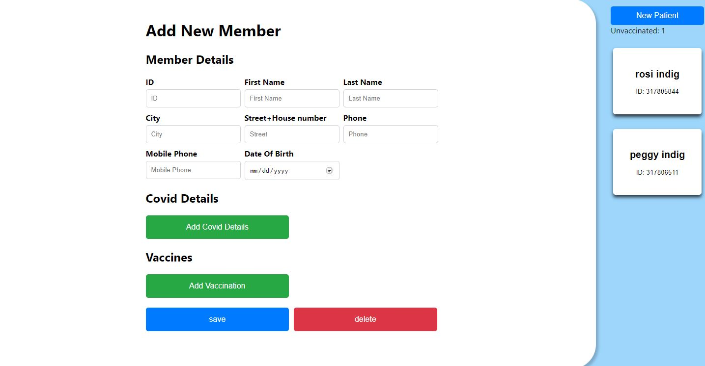
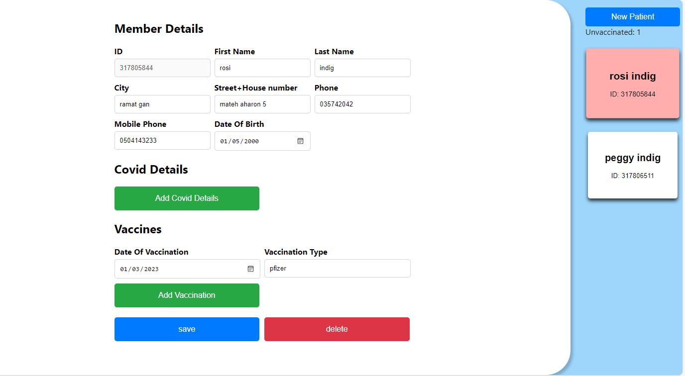

# COVID Patients Server


This is a Node.js Express server for managing COVID patient data.


# System Overview

This system provides a user-friendly interface for managing member records. Here are the main features:

## Member List

- Upon entering the system, you will reach the main page where a list of all the members will appear on the right side.
- Clicking on a member from the list will open a tab on the left side displaying all the information about the selected member.

## Member Information Tab

- In each member tab, you can update, add information, or delete the record.

## New Patient Button

- At the top of the list, there is a "New Patient" button.
- Clicking on this button will open a tab with a form to add a new client.
- In the client addition form, all fields must be filled with correct values.
- Partial filling or filling with invalid values will not allow the member to be added to the member database and will lead to an error message.
- Below the button, the number of members who are not vaccinated at the checkout will be displayed.

## Client Addition Information
- Below the "New Patient" button, the number of members who are not vaccinated at the checkout will be displayed.


## Installation

1. Clone the repository:

  ```bash
  git clone https://github.com/your-username/covid-patients-server.git
  ```

2. Navigate to the project directory:

  ```bash
  cd covid-patients-server
  ```

3. Install the dependencies:

  ```bash
  npm install
  ```

## Usage

To start the server, run the following command:
  
  ```bash
  npm run dev
  ```

